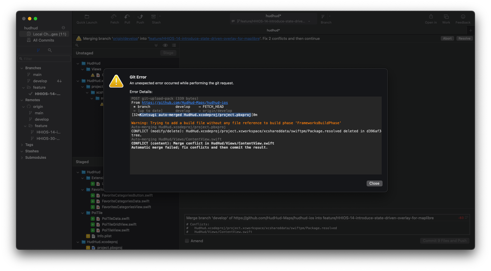

# HUDHUD App - Proof of Concept Phase

Goal of this repo is to make a simple app that can:
* Searching for a POI
* Displaying POI information on MapLibre
* Starting a navigation using MapLibre Navigation

## Setup

- Clone this Repo
- Run: git checkout main
- Run: git flow init and use the default answers like so:

```
Which branch should be used for bringing forth production releases?
   - develop
   - main
Branch name for production releases: [main]

Which branch should be used for integration of the "next release"?
   - develop
Branch name for "next release" development: [develop]

How to name your supporting branch prefixes?
Feature branches? [feature/]
Release branches? [release/]
Hotfix branches? [hotfix/]
Support branches? [support/]
Version tag prefix? []
``` 
### Git Flow

We follow the Git Flow branching model for development. The main branches are:

master: Represents the production-ready code.
develop: Serves as the integration branch for new features.
For feature development, create a new branch off develop:

```bash
git checkout develop
git pull origin develop
git checkout -b feature/HHIOS-NNNN-my-awesome-feature
```
Ensure the name of your branch contains the ticket number (HHIOS-NNNN) so that the Jira integration can link it.

After completing the feature, submit a pull request to merge it into develop.

### Kintsugi

There is a nice tool to fix Xcode project merge conflicts: https://github.com/Lightricks/Kintsugi. Installing this on an M1 machine is tricky as the preinstalled Ruby installtion has its quirks.

Add this to your `~/.zprofile`

```bash
export GEM_HOME="$HOME/.gem"
path+=("$GEM_HOME/bin")
export PATH
```

Then install kintsugi by running

```bash
gem install kintsugi
```

As a last step, it is recommended to instruct git, to use this for merge conflicts:

```bash
kintsugi install-driver
```

##### Optional GUI Git Client

If you use only the command line then your setup is finished here.
If you use a GUI git client (I recommend https://fork.dev) then this will not work as Fork doesn't know where kintsugi is installed. I fixed this by adjusting my global gitconfig in `~/.gitconfig` as follows:

```bash
[merge "kintsugi"]
	name = Kintsugi driver
	driver = export GEM_HOME="$HOME/.gem" && $GEM_HOME/bin/kintsugi driver %O %A %B %P
```

If everything is seutp correctly this is how it will look when you encounter a merge conflict. Notice how it says `Kintsugi auto-merged HudHud.xcodeproj/project.pbxproj`.



```bash
POST git-upload-pack (339 bytes)
From https://github.com/HudHud-Maps/hudhud-ios
 * branch            develop    → FETCH_HEAD
 = [up to date]      develop    → origin/develop
Kintsugi auto-merged HudHud.xcodeproj/project.pbxproj

Warning: Trying to add a build file without any file reference to build phase 'FrameworksBuildPhase'
Auto-merging HudHud.xcodeproj/project.pbxproj
CONFLICT (modify/delete): HudHud.xcodeproj/project.xcworkspace/xcshareddata/swiftpm/Package.resolved deleted in d396af3c1a8f95265ed412e0fa99bfd3cc1603d0 and modified in HEAD.  Version HEAD of HudHud.xcodeproj/project.xcworkspace/xcshareddata/swiftpm/Package.resolved left in tree.
Auto-merging HudHud/Views/ContentView.swift
CONFLICT (content): Merge conflict in HudHud/Views/ContentView.swift
Automatic merge failed; fix conflicts and then commit the result.
```


### Code Style

We use the Ray Wenderlich Code Style: https://github.com/raywenderlich/swift-style-guide. SwiftLint is used to enforce a consistent code style. Before submitting a pull request, ensure your code adheres to the SwiftLint rules. SwiftLint is run automatically as part of the build.

### Pull Requests

You should not self merge your branches. Instead after creating your branch via the 'git flow feature ...'
command and completing your issue, you should push your branch to github and create
a pull request if it passes tests. If your branch does not pass tests please fix the issue first and re-push (see Fixing Conflicts above).
Once tests pass, assign one of the senior devs as the reviewer. The reviewer will review
your code and merge it if its ok, or request changes.

## Design

### General approach

We encourage to use SwiftUI for new UI components whenever it's possible.
When old xibs or storyboards are subjects of significant changes they should be converted to SwiftUI on the way.

All your SwiftUI views must provide Previews.
